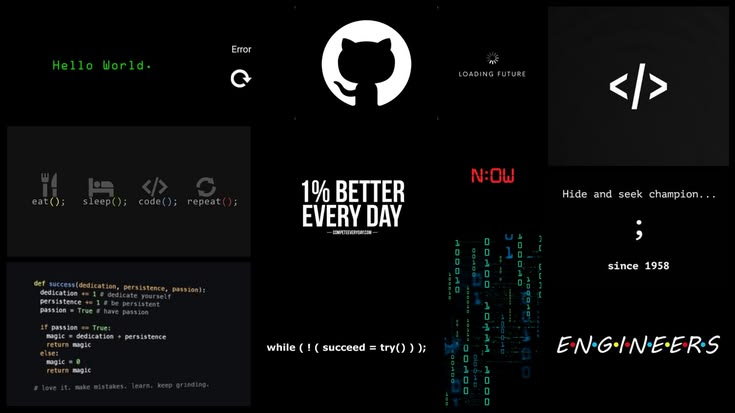

<!-- Repo banner 😅 -->

<!-- Typewritter-1 -->

<h1 align="center">
    
</h1>

## ⚙ **Languages-Frameworks-Tools**

 

  <!-- Languages -->
  
<b>Languages:</b>

  
    

  <!-- Frameworks & libraries -->
  
<b>Frameworks & Libraries:</b>

  
    

  <!-- Tools & platforms -->
  
<b>Tools & Platforms:</b>

  

 

<!-- Find me around the web -->

## 🌐 **Where to find me**

 

     

<!-- ********===Gh profile summary********=== -->

<h2 style="margin: 2.5em 0;">⚡ Stats ⚡</h2>

<!-- GitHub stats -->

  

<!-- GitHub streaks -->

  

  <!-- Most used languages -->

  

<!-- Typewritter-2 -->
<h3 align="center">
    
</h3>

<!-- contribution graph snake animation -->
<picture>
  <source media="(prefers-color-scheme: dark)" srcset="https://raw.githubusercontent.com/quinton161/quinton161/output/github-snake-dark.svg" />
  <source media="(prefers-color-scheme: light)" srcset="https://raw.githubusercontent.com/quinton161/quinton161/output/github-snake.svg" />
  
</picture>
